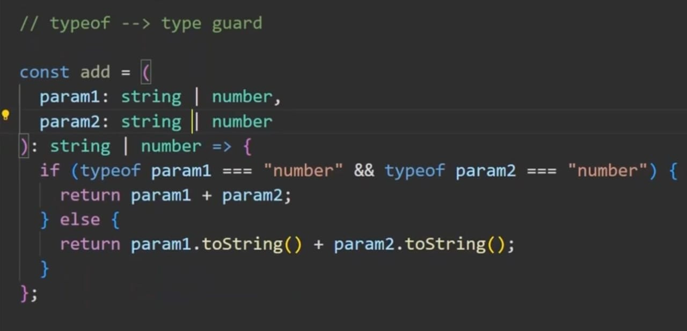
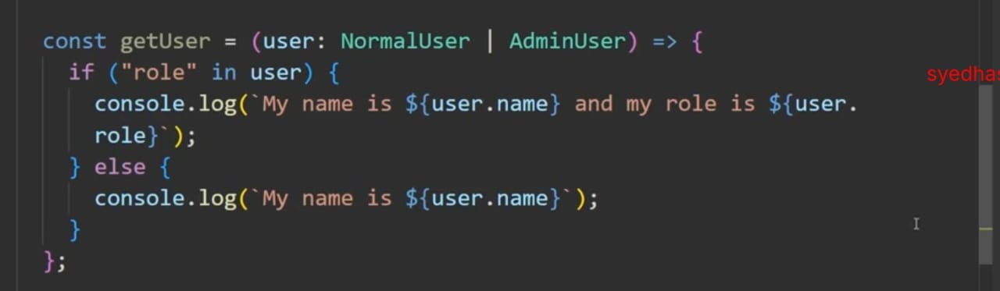
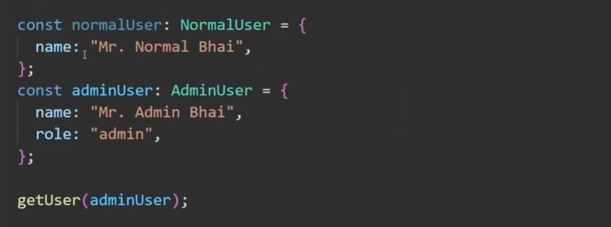
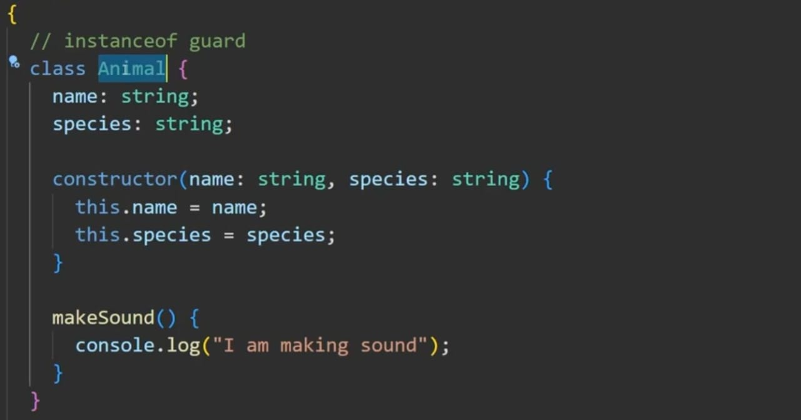
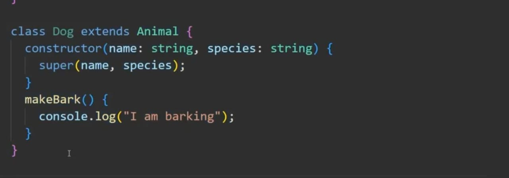
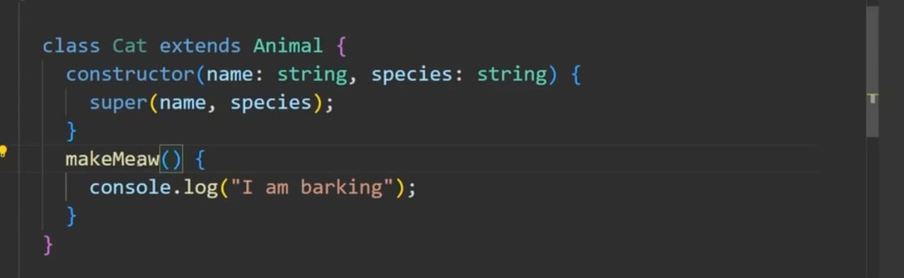
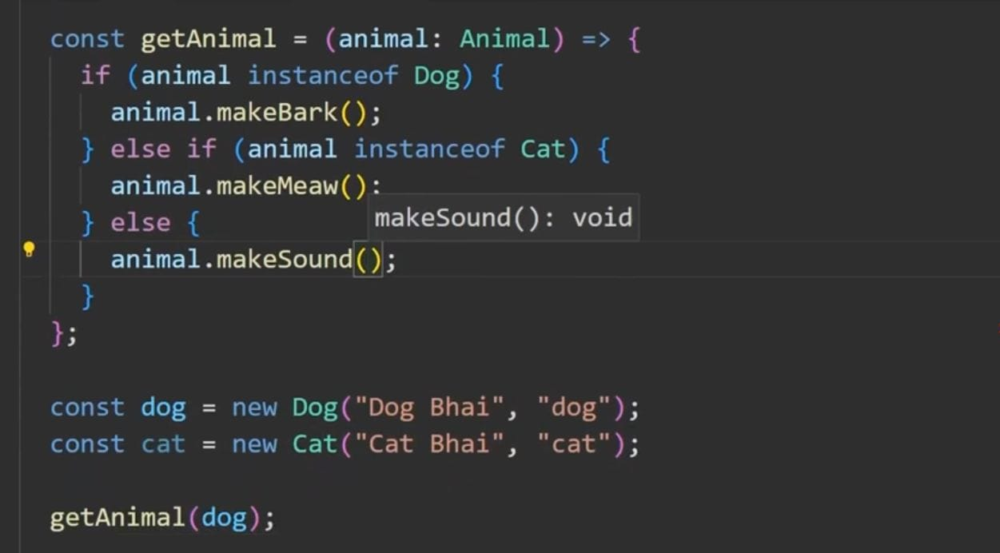

<!-- Type guard -->

basically Type guard is way to prevent unnecessary behaviour and improve performance of
your application or code blocks.
it is a way to get information about the type of a variable . It's a normal function that return boolean and most of the time used on conditional block to tell typescript if it can be narrow down or something more speciifc . based on the return different code is executed which make the application more versatile and enhance performance and code readability..
there are basically three operator used in type guard . they are instanceof , typeof and in operator.
Usually in functional Programming and in primitive types we use typeof operator and in OOP (object oriented programming) we use instanceof operator . and to check whether a object has certain properties we use in operator. Let's understand it more througly with below example
typeof operator

here add function that recieves two parameters they can be either a string or a number and we want that if they are both numbers we will add them othewise we will concat them
and this function will return either a string or a number. without typeof operator it'll messed up the whole thing and will return unexpected result that we defeinitly expect. to prevent this, we are using typeof operator. here in if blocks we can check the parameters type and if they both number will add them and return a number or else we will return a string by concating them . this will prevent misbehavior of add fucntion

<!-- in operator -->

In operator used in object to check if the property is a key of that object.

in above , we have to type that is NormalUser and AdminUser . and we're gonna create function that will check if the params we're recieving is a NormalUser or AdminUser.

look above, We got a function getUser that will recieve use as parameter and return if the user is a admin by consoling usr name or role(for admin). in this function in if block we're checing if "role" property a part of user by using in operator. if it's then we'll console user name and role otherwise we're gonna console user name only.

<!-- instanceof -->

instanceof operator use in class to check whether the params we're recieving is instance of certain Class

in above example, we got a Animal class that have name and species as properties and makeSound as method . we're gonna create twp more class Cat and Dog respectively by using inheritance.

in Dog Class added to Animal class properties and methods we've got a new method that's makeBark and makeMeaw for Cat class.
now we want create a function getAnimal that will recieves a animal(dog,cat) and will use the method makeBark if it's a dog else it will use the method makeMeaw if it's a cat or it'll use the common method makeSound
to check if the parameter is dog or cat we need to use instanceof operator

here above , we are checking if the parameter is a instace of the Dog class and using the method makeBark if it's not a Dog Class instance we are checking if the parameter is a instance of the Cat class and use the method makeMeaw.if it's neither Dog or Cat we are using makeSound method from parent class Animal
